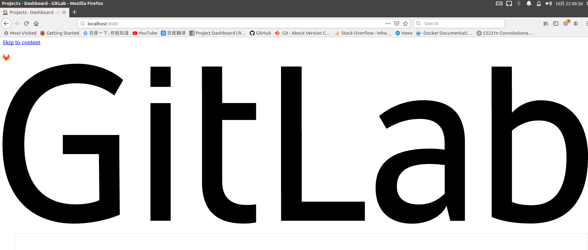

# GitLab导致8080端口冲突

## 问题复现

安装完`GitLab`后，修改配置文件`/etc/gitlab/gitlab.rb`

```
##external_url 'http://gitlab.example.com'
external_url 'http://localhost:8800'
```

本以为这样就能修改`GitLab`端口号为`8800`了，没想到再次登录`8080`仍旧出现了`GitLab`页面



## 问题解析

查询哪个程序监听了`8080`端口

```
# netstat -lnp | grep 8080
tcp        0      0 127.0.0.1:8080          0.0.0.0:*               LISTEN      26436/config.ru 
```

查询相应的进程

```
# netstat -lnp | grep 26436
tcp        0      0 127.0.0.1:8080          0.0.0.0:*               LISTEN      26436/config.ru 
unix  2      [ ACC ]     STREAM     LISTENING     343538   26436/config.ru     /var/opt/gitlab/gitlab-rails/sockets/gitlab.socket
```

仍然是`GitLab`在监听`8080`端口，参考[gitlab 8.13 80 8080端口冲突问题](https://blog.csdn.net/vbaspdelphi/article/details/52979836)，查看配置文件`unicorn.rb`

```
# This file is managed by gitlab-ctl. Manual changes will be
# erased! To change the contents below, edit /etc/gitlab/gitlab.rb
# and run `sudo gitlab-ctl reconfigure`.

# What ports/sockets to listen on, and what options for them.
listen "127.0.0.1:8080", :tcp_nopush => true
```

默认情况下`unicorn`同样监听`8080`端口，查询`/etc/gitlab/gitlab.rb`中相应的设置

```
# cat gitlab.rb | grep unicorn
#unicorn['port'] = 8800
```

## 解决方案

需要在`gitlab.rb`上同时修改`unicorn`监听端口号，修改配置文件`/etc/gitlab/gitlab.rb`如下

```
##external_url 'http://gitlab.example.com'
external_url 'http://localhost:8800'
unicorn['port'] = 8800
```

重新启动`GitLab`

```
# gitlab-ctl reconfigure
# gitlab-ctl restart
```

测试端口号

```
$ curl localhost:8080
curl: (7) Failed to connect to localhost port 8080: Connection refused
$ curl localhost:8800
<!DOCTYPE html>
<html>
<head>
  <meta content="width=device-width, initial-scale=1, maximum-scale=1" name="viewport">
...
...
```